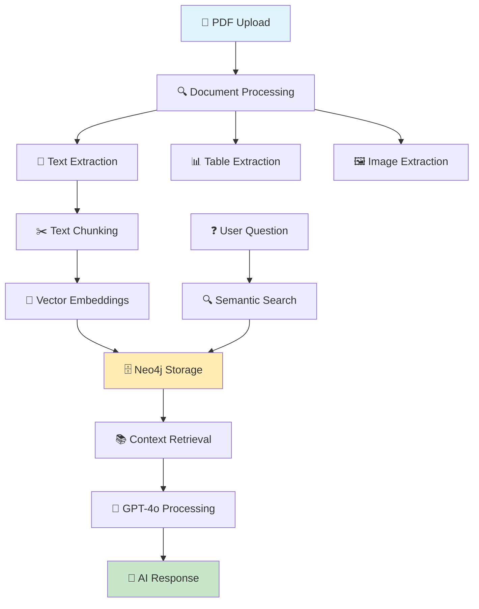

# 🚀 Multimodal RAG with Neo4j & DoclingLoader

<div align="center">


**Advanced RAG System with Multimodal Document Processing and Graph Database Storage**

[📚 Documentation](#-documentation) • [🚀 Quick Start](#-quick-start) • [🔧 API Reference](#-api-reference) • [🏗️ Architecture](#️-architecture)

</div>

---

## 📖 Overview

This project implements a state-of-the-art **Retrieval-Augmented Generation (RAG)** system that combines:

- 🔍 **Multimodal Document Processing** - Extract text, tables, and images from PDFs
- 🌐 **Graph Database Storage** - Neo4j for advanced relationship mapping
- 🤖 **AI-Powered Q&A** - OpenAI GPT-4o for intelligent responses
- ⚡ **FastAPI Backend** - High-performance REST API
- 🎯 **Semantic Search** - Vector embeddings for context-aware retrieval

## ✨ Key Features

| Feature | Description | Status |
|---------|-------------|--------|
| 📄 **PDF Processing** | Extract text, tables, and images using PyMuPDF | ✅ |
| 🧠 **Intelligent Chunking** | Smart text splitting with overlap | ✅ |
| 🔗 **Graph Relationships** | Store document chunks with Neo4j | ✅ |
| 🎯 **Vector Search** | Semantic similarity using OpenAI embeddings | ✅ |
| 🤖 **AI Q&A** | Context-aware responses with GPT-4o | ✅ |
| 🌐 **REST API** | FastAPI with automatic documentation | ✅ |
| 📊 **Multimodal Data** | Process text, tables, and images | ✅ |

## 🏗️ Architecture



## 🚀 Quick Start

### 📋 Prerequisites

- 🐍 **Python 3.13+**
- 📊 **Neo4j Aura Account** (free tier available)
- 🔑 **OpenAI API Key**
- 💾 **8GB+ RAM** recommended

### ⚙️ Installation

1. **📥 Clone the Repository**
   ```bash
   git clone https://github.com/lokeshpanthangi/Advanced_Graph_RAG.git
   cd Advanced_Graph_RAG/Backend
   ```

2. **🐍 Create Virtual Environment**
   ```bash
   python -m venv venv
   # Windows
   venv\Scripts\activate
   # Linux/Mac
   source venv/bin/activate
   ```

3. **📦 Install Dependencies**
   ```bash
   pip install -r requirements.txt
   ```

4. **🔧 Environment Setup**
   ```bash
   cp .env.example .env
   # Edit .env with your credentials
   ```

### 🔑 Environment Configuration

Create a `.env` file with the following variables:

```env
# 🤖 OpenAI Configuration
OPENAI_API_KEY=your_openai_api_key_here

# 🗄️ Neo4j Configuration
NEO4J_URI=neo4j+s://your-instance.databases.neo4j.io
NEO4J_USERNAME=your_username
NEO4J_PASSWORD=your_password

# ⚙️ RAG Configuration
CHUNK_SIZE=1000
CHUNK_OVERLAP=200
```

### 🚀 Launch the Server

```bash
uvicorn main:app --reload --port 8000
```

🎉 **Server running at:** http://localhost:8000

📚 **API Documentation:** http://localhost:8000/docs

## 🔧 API Reference

### 📤 Upload PDF

**Endpoint:** `POST /uploadfile_PDF/`

Upload and process a PDF document for multimodal extraction.

```bash
curl -X POST "http://localhost:8000/uploadfile_PDF/" \
     -H "accept: application/json" \
     -H "Content-Type: multipart/form-data" \
     -F "file=@document.pdf"
```

**Response:**
```json
{
  "filename": "document.pdf",
  "num_chunks": 15,
  "chunks": ["Text chunk 1...", "Text chunk 2...", "Text chunk 3..."],
  "tables": [
    {
      "page": 0,
      "bbox": [100, 200, 500, 400],
      "rows": [["Header 1", "Header 2"], ["Data 1", "Data 2"]]
    }
  ],
  "images": [
    {
      "page": 0,
      "path": "/tmp/pdf_image_0_0.png",
      "width": 800,
      "height": 600
    }
  ]
}
```

### 🏥 Health Check

**Endpoint:** `GET /health`

Check system status and connectivity.

```bash
curl http://localhost:8000/health
```

**Response:**
```json
{
  "status": "healthy"
}
```

## 📊 Usage Examples

### 🐍 Python Client

```python
import requests

# Upload PDF
with open("document.pdf", "rb") as f:
    response = requests.post(
        "http://localhost:8000/uploadfile_PDF/",
        files={"file": f}
    )
    result = response.json()
    print(f"📄 Processed {result['num_chunks']} chunks")
```

### 🌐 JavaScript/Fetch

```javascript
const formData = new FormData();
formData.append('file', fileInput.files[0]);

fetch('http://localhost:8000/uploadfile_PDF/', {
    method: 'POST',
    body: formData
})
.then(response => response.json())
.then(data => {
    console.log('📄 Upload successful:', data);
});
```

### 💻 PowerShell

```powershell
$response = Invoke-RestMethod -Uri "http://localhost:8000/uploadfile_PDF/" `
                              -Method Post `
                              -Form @{ file = Get-Item "document.pdf" }
Write-Output "📄 Processed $($response.num_chunks) chunks"
```

## 🔍 Features Deep Dive

### 📄 Document Processing Pipeline

1. **📥 Upload Stage**
   - Secure file validation
   - Temporary file handling
   - Format verification

2. **🔍 Extraction Stage**
   - **Text**: Full document text extraction
   - **Tables**: Structured data with bounding boxes
   - **Images**: Binary data with metadata

3. **✂️ Chunking Stage**
   - Intelligent text splitting
   - Configurable chunk size (default: 1000 chars)
   - Overlap for context preservation (default: 200 chars)

4. **🧮 Embedding Stage**
   - OpenAI text-embedding-3-small
   - Vector representation for semantic search
   - Neo4j vector index storage

### 🗄️ Neo4j Graph Structure

```cypher
// Document chunks with relationships
(:Chunk {id: "chunk_abc123", text: "...", source: "document.pdf"})
-[:NEXT]->
(:Chunk {id: "chunk_def456", text: "...", source: "document.pdf"})

// Vector index for semantic search
CREATE VECTOR INDEX pdf_chunks_index 
FOR (c:Chunk) ON (c.embedding)
OPTIONS {indexConfig: {`vector.dimensions`: 1536, `vector.similarity_function`: 'cosine'}}
```

## 🛠️ Development

### 🧪 Running Tests

```bash
# Install test dependencies
pip install pytest pytest-asyncio httpx

# Run tests
pytest tests/ -v
```

### 🐛 Debugging

Enable debug logging by setting:

```python
import logging
logging.basicConfig(level=logging.DEBUG)
```

### 📊 Monitoring

Access FastAPI's built-in metrics at:
- 📚 **API Docs**: http://localhost:8000/docs
- 🔍 **OpenAPI Schema**: http://localhost:8000/openapi.json

## 🚨 Troubleshooting

### Common Issues

| Issue | Solution |
|-------|----------|
| 🚫 **404 on PDF upload** | Ensure trailing slash: `/uploadfile_PDF/` |
| 🔌 **Neo4j connection failed** | Check URI, credentials, and firewall |
| 🤖 **OpenAI API errors** | Verify API key and usage limits |
| 📄 **PDF processing fails** | Check file format and permissions |

### 🔧 Debug Steps

1. **Check Health Endpoint**
   ```bash
   curl http://localhost:8000/health
   ```

2. **Verify Environment Variables**
   ```bash
   python -c "import os; from dotenv import load_dotenv; load_dotenv(); print('✅ Env loaded')"
   ```

3. **Test Neo4j Connection**
   ```bash
   python test_neo4j_connection.py
   ```

## 📈 Performance

### ⚡ Optimization Tips

- **Chunking**: Adjust `CHUNK_SIZE` based on document complexity
- **Concurrency**: Use `uvicorn --workers 4` for production
- **Caching**: Implement Redis for frequently accessed embeddings
- **Database**: Use Neo4j Enterprise for large-scale deployments

### 📊 Benchmarks

| Document Size | Processing Time | Memory Usage |
|---------------|----------------|--------------|
| 1-5 pages     | ~2-5 seconds   | ~100MB       |
| 10-20 pages   | ~8-15 seconds  | ~200MB       |
| 50+ pages     | ~30-60 seconds | ~500MB       |


## 🙏 Acknowledgments

- 🤖 **OpenAI** for GPT-4o and embedding models
- 🗄️ **Neo4j** for graph database technology
- ⚡ **FastAPI** for the high-performance web framework
- 📄 **PyMuPDF** for PDF processing capabilities
- 🦜 **LangChain** for RAG orchestration

## 📞 Support

- 📧 **Email**: lokeshpantangi@gmail.com
- 💬 **Issues**: [GitHub Issues](link-to-issues)
- 📖 **Documentation**: [Full Docs](link-to-docs)

---

<div align="center">

**Built with ❤️ for the AI Community**

⭐ Star this repo if it helped you! ⭐

</div>